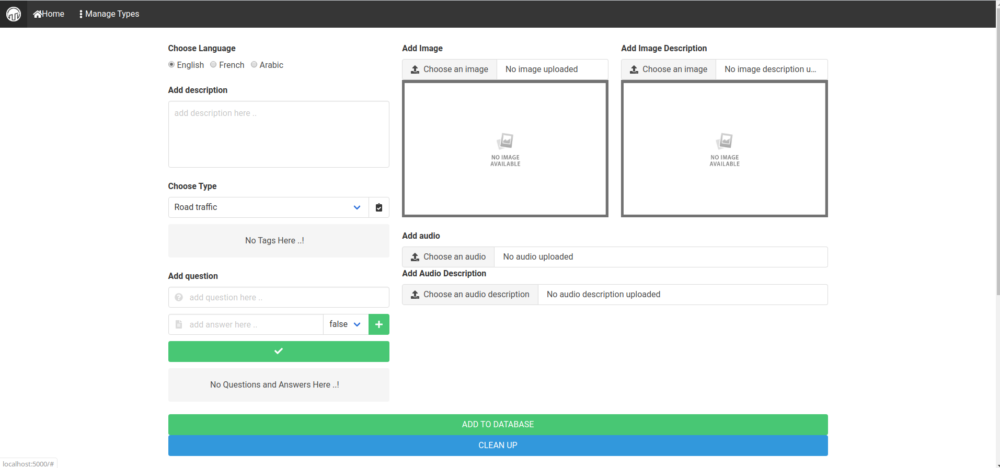
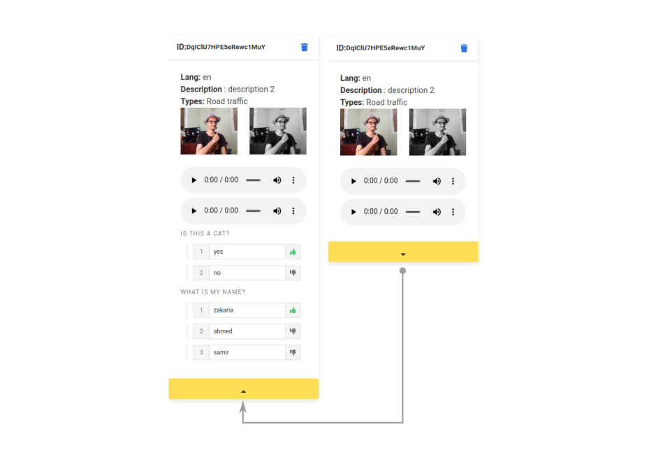

# SIMPLE & BEAUTY CRUD FORM TO FIREBASE

------------------------------

**Svelte.js + Firebase/Storage + Bulma.css +** :revolving_hearts:

### Instalations:
`cd just_upload_to_firebase`

`npm i`

### Run!
`npm run dev`

*(on http://localhost:5000)*

#### Screenshots:

------------------------------

zakaria chahboun 2020 :wink:
